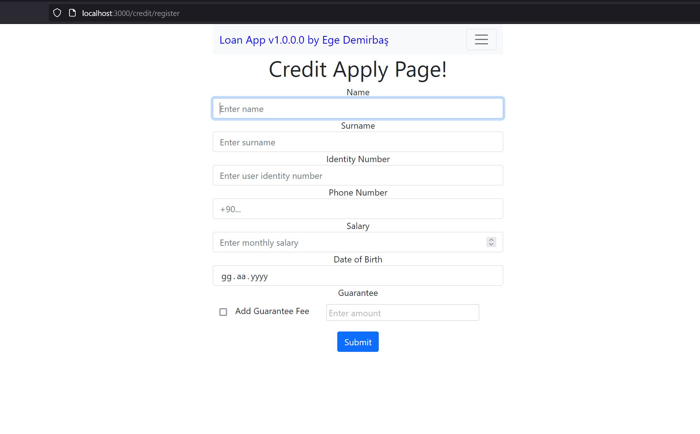
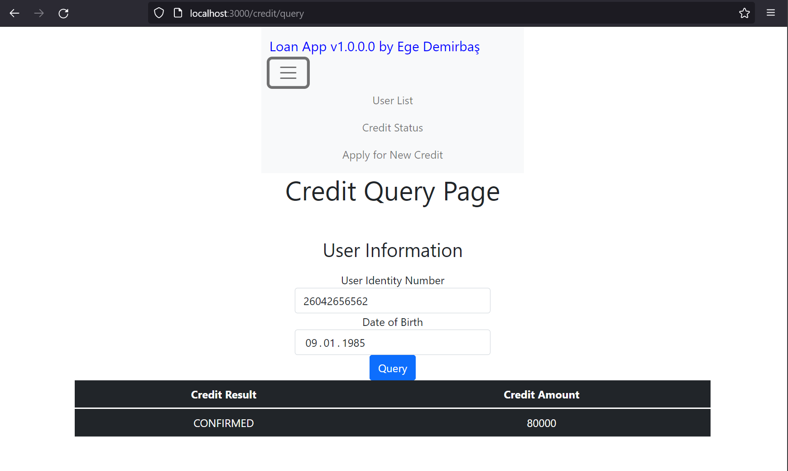

<div align="center">
    <div style="height:120px;">
        
        <h1 style="display:inline;color:red;">N11 TalentHub Final Project</h1>
        <h6>by Ege Demirbaş</h6>
    </div>
    <p align="center">
        
        
        
         
        
        <a>
            <a style="margin-right:0px;margin-left:60px;color:green;">Powered by</a>
            
        </a>
    </p>
</div>

---

## About

A Restfull Application based on Spring Boot Framework which consist of two sub projects. 
First project is back-end of the Loan App and the second one is the front-end part.
Application capabilities are:

    - Registering to system as new user to apply for credit.
    - Credit status inquiry.
    - List of users registered into system.

<div>
    <p align="center">
        
        
    </p>
</div>

## Technical Information

Project consist of two sections, first section is back-end of the project, which based on Spring Framework. Postgres SQL is getting used as database and Hibernate Framework handles the interaction.

Backend part of the project is ready to deploy and current configured to running at  <span style="color:red">localhost:8081</span>.

---

### Back End

Here are the list of services and entities exist inside of the back-end part.

    Entities:
            User
            Credit
    Controllers:
            UserController
            CreditController
    Dao's(Database Access Objec):
            UserDao
            CreditDao
    Dto's(Database Transfer Object):
            UserDto
    Converters:
            UserConverter - converts userDto to user.
    Exceptions:
            UserNotFoundException
            CreditNotFoundException
    Enums:
            Enum Credit Guarantee Type: determines whether user paid gurantee fee while applying for credit or not.
                - Paid
                - Not Paid
            Enum Credit Result: determines the result of credit inquiry of a user.
                - CREDIT_CONFIRMED
                - CREDIT_REJECTED
    Services:
            UserEntityService
            CreditEntityService
            CreditModelService: Determines the credit amount and result by getting necessary information from user.
            SmsMessageService: Pushes sms to user and informs It about the result of credit transaction.

#### Calculating The Credit Score

Credit score calculation is based on simple a algorithm that takes the age, salary and guranatee index from user and combines with pre-determined coefficients to obtain user credit score.

Method Name: <span style="color:red">CalculateUserCredit</span>
```
credit score = ∑〖1.354 x ageIndex+ 0.85 x salaryIndex+2.1.2 x guaranteeIndex〗
```

once the credit score is calculated, then <span style="color:red">CreateUserCredit</span> method is getting called and applies the rules that determined by our project and returns the result of user credit.

---

## Front End

Frontend is a React project, which serves as user interface. Here, new users can register to system and apply for credit. Pre-applied users can always inquiry their credit apply result by entering their user-identity number and date of births.
Note that users can only apply once for credit.

Frontend part of the project is ready to deploy and current configured to running at  <span style="color:red">localhost:3030</span>.
To deploy front-end project, you need to use:
```node
npm start
```